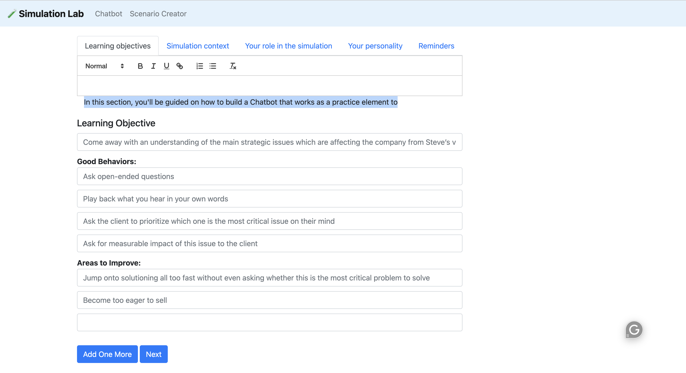

# Django ChatGPT Chatbot

## Features

- Real-time chat with GPT-4.0 powered Chatbot
- Seamless integration with Django web application
- Natural Language Processing for human-like interactions
- Easily extendable and customizable for specific use cases

## Screens

- Where all the user-created scenarios could be found here. Currently only implemented front end.

- Currently only implemented the front end. 

- Interact with the bot and get feedback

- Full roleplay history 

